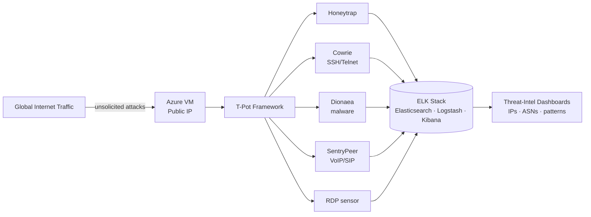

# Cloud Honeypot & Threat Intelligence Platform — T-Pot on Azure

> A personal home-lab project: I deployed a live, internet-facing multi-honeypot on Microsoft Azure and used it to collect and analyse real-world attack telemetry — **98,565 attack attempts captured in the first 24 hours.**

---

## Overview

This lab answers a simple question: *what actually hits an exposed server on the public internet, and how fast?* I stood up the [T-Pot](https://github.com/telekom-security/tpotce) honeypot framework on an Azure VM, deliberately exposed it to global traffic, and built an analytics workflow to turn the raw attack logs into threat intelligence — mapping attacker IPs, ASNs, and credential-stuffing patterns.

> ⚠️ **Ethics & scope:** This is an isolated, purpose-built honeypot on infrastructure I own. It only *records* unsolicited traffic directed at it. Nothing here attacks or scans third parties.

---

## Architecture

---

## Tools & Technology

| Category | Tools |
|---|---|
| Cloud | Microsoft Azure (Linux VM, Public IP, NSG) |
| Honeypot framework | T-Pot |
| Sensors / daemons | Honeytrap, Cowrie, Dionaea, SentryPeer, RDP |
| Analytics | ELK Stack (Elasticsearch, Logstash, Kibana) |
| Analysis focus | Attacker IP / ASN attribution, credential-stuffing detection |

---

## What I Did

1. **Provisioned** a dedicated Linux VM in Azure and configured the Network Security Group to allow the honeypot's listening ports through to the exposed traffic.
2. **Deployed T-Pot**, bringing up multiple honeypot daemons (Honeytrap, Cowrie, Dionaea, SentryPeer, and an RDP sensor) behind a single managed stack.
3. **Exposed the VM** to global internet traffic and let it collect unsolicited attack telemetry.
4. **Analysed the data** in the built-in ELK stack — building views over attacker source IPs, originating ASNs, targeted services, and repeated credential-stuffing attempts.

---

## Key Results

- **98,565 attack attempts logged in the first 24 hours** (100,000+ events total across the collection window).
- Attacks observed across **multiple protocols and services** — SSH/Telnet brute force (Cowrie), malware delivery attempts (Dionaea), SIP/VoIP abuse (SentryPeer), and RDP probing.
- Identified the **top attacking IPs and ASNs** and recurring **credential-stuffing username/password pairs**.

---

## What I Learned

- How quickly an unprotected public host is discovered and attacked (minutes, not days).
- Reading attack telemetry at scale and turning it into attributable threat intelligence (IP → ASN → behaviour).
- The value of layered honeypot sensors for capturing different attacker techniques.

---

## Skills Demonstrated

`Threat Intelligence` · `Honeypots` · `Microsoft Azure` · `ELK Stack` · `Log Analysis` · `Attacker Attribution` · `Network Security`

---

## About Me

**Kuldeep Mishra** — aspiring SOC Analyst.
📧 km828591@gmail.com · 🔗 [LinkedIn](https://www.linkedin.com/in/kuldeep-mishra-soc/) · 💻 [GitHub](https://github.com/Kuldeep-Mishra00)
