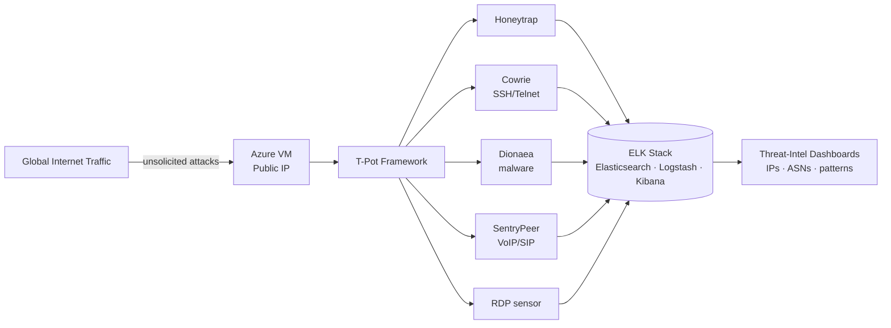

# Cloud Honeypot & Threat Intelligence Platform — T-Pot on Azure

> A personal home-lab project: I deployed a live, internet-facing multi-honeypot on Microsoft Azure and used it to collect and analyse real-world attack telemetry — **98,565 attack attempts captured in a rolling 24-hour window (100,000+ total security incidents logged).**

---

## Overview

This lab answers a simple question: *what actually hits an exposed server on the public internet, and how fast?* I stood up the [T-Pot](https://github.com/telekom-security/tpotce) honeypot framework (Community Edition) on an Azure VM, deliberately exposed it to global traffic, and built an analytics workflow to turn the raw attack logs into threat intelligence — mapping attacker IPs, ASNs, and credential-stuffing patterns.

> ⚠️ **Ethics & scope:** This is an isolated, purpose-built honeypot on infrastructure I own. It only *records* unsolicited traffic directed at it. Nothing here attacks or scans third parties.

---

## Architecture

---

## Tools & Technology

| Category | Tools |
|---|---|
| Cloud | Microsoft Azure (Linux VM "HoneyPot", Public IP, NSG, Trusted Launch + Secure Boot) |
| Honeypot framework | T-Pot (Community Edition) |
| Sensors / daemons | Honeytrap, Cowrie, Dionaea, SentryPeer, RDPHoneypot |
| Analytics | ELK Stack (Elasticsearch, Logstash, Kibana) |
| Analysis focus | Attacker IP / ASN attribution, credential-stuffing detection |

---

## What I Did

1. **Provisioned** a dedicated Linux VM ("HoneyPot") in Azure with Trusted Launch and Secure Boot enabled to handle the concurrent pipeline load.
2. **Configured the Network Security Group** with ingress rules allowing inbound traffic across ports 1–65535 — intentionally maximising the attack surface — while routing administrative control through secure non-standard management ports.
3. **Deployed T-Pot**, bringing up multiple honeypot daemons (Honeytrap, Cowrie, Dionaea, SentryPeer, and an RDP sensor) behind a single managed stack.
4. **Analysed the data** in the built-in ELK stack — building views over attacker source IPs, originating ASNs, targeted services, and repeated credential-stuffing attempts.

---

## Key Results (from the Kibana / Elastic indices)

- **98,565 attack attempts logged in a rolling 24-hour window** — 100,000+ total security incidents across the deployment.

### Attack vectors & daemon breakdown

| Sensor | Hits | What it caught |
|---|---|---|
| Honeytrap | **39,000+** | Automated port scanning, reconnaissance probes, raw protocol tampering |
| RDPHoneypot | **32,000+** | Massive brute-force sweeps against Remote Desktop Protocol (port 3389) |
| Cowrie | **16,000+** | Interactive SSH/Telnet terminal hijack attempts and login sequences |
| SentryPeer | **10,000+** | Automated botnets enumerating VoIP/SIP telephony relays |
| Dionaea | **1,000+** | Exploit payloads attempting to drop malicious binaries/malware |

### Credential-stuffing highlights

- **Top usernames:** `Administrator` (by far), followed by `root`, `admin`, `user`, `testuser`
- **Top passwords:** *(blank)* — targeting misconfigured systems — plus `123456`, `password`, `1234`, `root`

### Threat-actor infrastructure & attribution

- **Top attacking ASNs:** BlueVPS OU (**20,864** hits), Google LLC (**20,684** hits), TechTies Inc.
- **Most aggressive IPs:** `91.211.27.22` (**20,844** attacks logged), `34.53.217.247`, `45.141.233.34`
- **IP reputation:** T-Pot's correlation indices classified a large share of inbound connections as verified **Known Attackers** (e.g. `45.198.224.18`, `204.76.203.51`)

---

## Deployment Artifacts (Evidence of Work)

### 1. Azure infrastructure running state

### 2. Live Kibana T-Pot dashboard — high-level metrics (100K+ cumulative strikes)

### 3. Attacker credentials & autonomous-system profiles

### 4. Real-time attack map & attacker IP logs

---

## What I Learned

- How quickly an unprotected public host is discovered and attacked (minutes, not days).
- Reading attack telemetry at scale and turning it into attributable threat intelligence (IP → ASN → behaviour).
- The value of layered honeypot sensors for capturing different attacker techniques.

---

## Skills Demonstrated

`Threat Intelligence` · `Honeypots` · `Microsoft Azure` · `ELK Stack` · `Log Analysis` · `Attacker Attribution` · `Network Security`

---

## About Me

**Kuldeep Mishra** — aspiring SOC Analyst.
📧 km828591@gmail.com · 🔗 [LinkedIn](https://www.linkedin.com/in/kuldeep-mishra-soc/) · 💻 [GitHub](https://github.com/Kuldeep-Mishra00)
