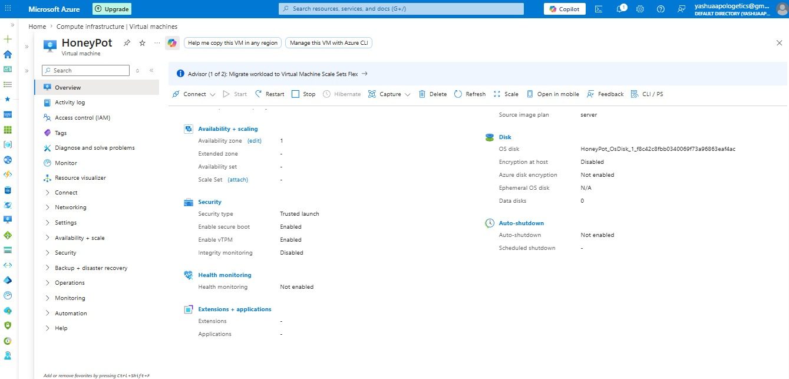

# Cloud-Based Threat Intelligence & Live Honeypot Deployment (T-Pot)

## 📌 Project Verification Profile

* Host Machine/Operator ID: CyberKull (Verified via active deployment profiles)

* Cloud Platform: Microsoft Azure

* Target Environment OS: Linux (Ubuntu Server Deployment)

* Infrastructure Security: Trusted Launch Enabled with Virtual TPM Execution

---

## 🚀 Project Overview

This project features the live cloud architecture and deployment of an enterprise-grade, multi-honeypot framework using Telekom Security's T-Pot (Community Edition) hosted on a live Microsoft Azure virtual instance. The core objective was to intentionally expose an unhardened system to global internet traffic, capture malicious telemetry, log behavioral vectors, and parse complex attacker data using an integrated cloud-native ELK Stack (Elasticsearch, Logstash, Kibana) pipeline.

Within a single deployment window, the honeypot framework recorded massive internet-wide exploitation traffic, successfully logging over 100,000+ total security incidents, with an intense volume of 98,565 distinct attacks captured within a rolling 24-hour window.

---

## 🏗️ Infrastructure & Network Architecture

1. Cloud Provisioning: Deployed a dedicated container host VM named HoneyPot on Microsoft Azure with Trusted Launch and Secure Boot architectures activated to handle the concurrent pipeline resource load.

2. Network Security Group (NSG) Configuration: Configured radical ingress firewall rules to allow all inbound traffic across ports 1 - 65535. This intentionally maximized the system's attack surface area for telemetry gathering, while administrative control layers were routed to secure non-standard management ports.

---

## 📊 Threat Intelligence & Real Data Analytics (Kibana Logs)

The data extracted directly from the Elastic analytical indices highlights a diverse range of sophisticated corporate automated scans, dictionary credential-stuffing campaigns, and protocol exploitation attempts:

### 1. Attack Vectors & Daemon Breakdown

* Honeytrap (39,000+ Hits): Dominated network logs; configured to capture automated port scanning, reconnaissance probes, and low-interaction raw protocol tampering.

* RDPHoneypot (32,000+ Hits): Extremely high target priority; trapped massive brute-force sweeps actively looking to exploit Remote Desktop Protocol flaws on port 3389.

* Cowrie (16,000+ Hits): Medium-interaction honeypot logging continuous interactive SSH/Telnet terminal hijack attempts and login sequences.

* Sentrypeer (10,000+ Hits): Caught persistent automated botnets enumerating VoIP and SIP telephony relays to find open configuration leaks.

* Dionaea (1,000+ Hits): Logged high-risk operational exploit payloads explicitly intent on transferring malicious binaries or malware droppers.

### 2. Targeted Credential Triage (Brute-Force Dictionary Highlights)

* Top Username Vectors: Automated scripts overwhelmingly targeted the default administrative moniker Administrator, followed tightly by alternative defaults like root, admin, user, and testuser.

* Top Password Vectors: Threat actors primarily relied on leaving the credential string completely *(blank)* to catch misconfigured systems, supplemented by massive credential-stuffing iterations of generic sequences such as 123456, password, 1234, and root.

### 3. Threat Actor Infrastructure & Source Reputation

* High-Volume Infrastructure Scanners: The top automated attack volume originated from network providers associated with high-scale autonomous systems including BlueVPS OU (20,864 counts), Google LLC (20,684 counts), and TechTies Inc.

* Malicious Geolocation Mapping: The live tracking matrix analyzed threat indicators across multiple geographical streams, isolating aggressive malicious IPs such as 91.211.27.22 (20,844 attacks logged), 34.53.217.247, and 45.141.233.34.

* IP Reputation Feeds: T-Pot's internal correlation indices automatically queried external threat intelligence repositories, classifying a massive chunk of inbound connections directly as verified Known Attackers (e.g., source IPs 45.198.224.18 and 204.76.203.51).

---

## 📸 Deployment Artifacts (Evidence of Work)

### 🖥️ 1. Azure Infrastructure Running State

Verification of the container host deployment and health configurations on the Microsoft Azure console.

### 📊 2. Live Kibana T-Pot Dashboard — High-Level Metrics

Visualizing the 100K+ cumulative honeypot strikes, histograms, and daemon hit distributions.

### 👤 3. Attacker Credentials & Autonomous System Profiles

Parsing the password tag-clouds, targeted vulnerability CVE frequencies, and top malicious host ASNs.

### 🗺️ 4. Real-Time Attack Map & Attacker IP Logs

Geographical mapping of live infrastructure hits alongside real-time IP reputation tracking.

---

## 🎯 Key Takeaways & Skills Validated

* Cloud Systems Hardening: Hands-on knowledge of Azure VM compute provisioning, Network Security Group (NSG) firewall rules manipulation, and public endpoint exposures.

* Threat Modeling & Reconnaissance: Deep insight into real-world malicious actor automated behaviors, common script dictionary matrices, and active port scanning metrics.

* SIEM Engineering & Analytics: Mastery over parsing live JSON events inside an Elastic Stack environment, building visualizations, and monitoring complex SIEM dashboard infrastructure.
